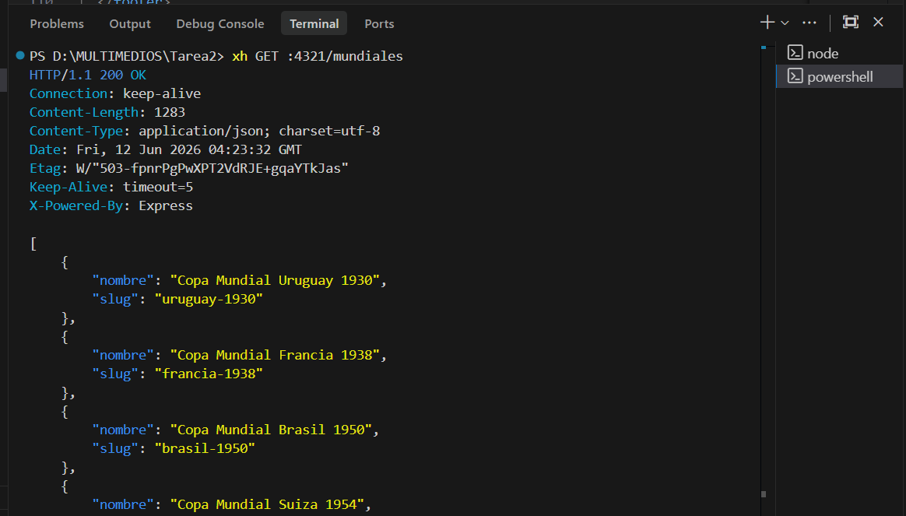
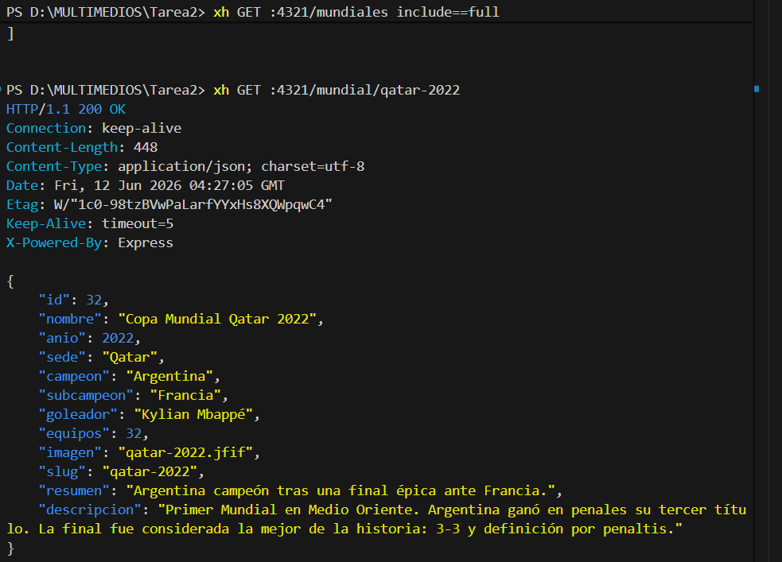
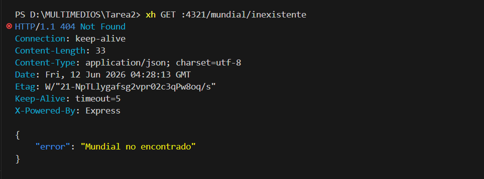
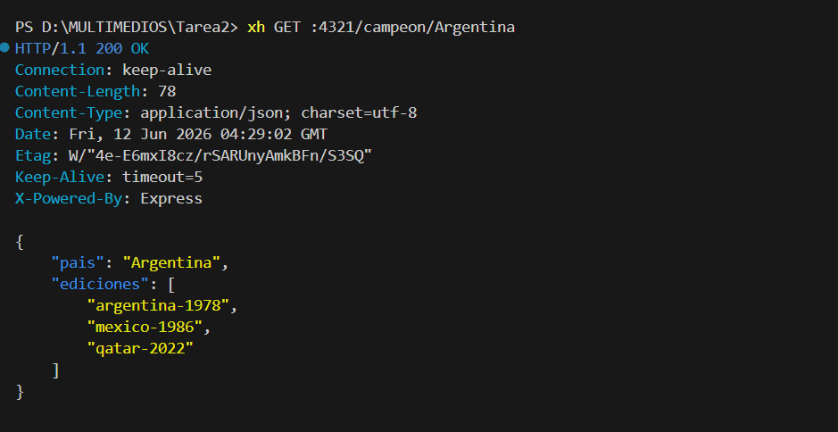
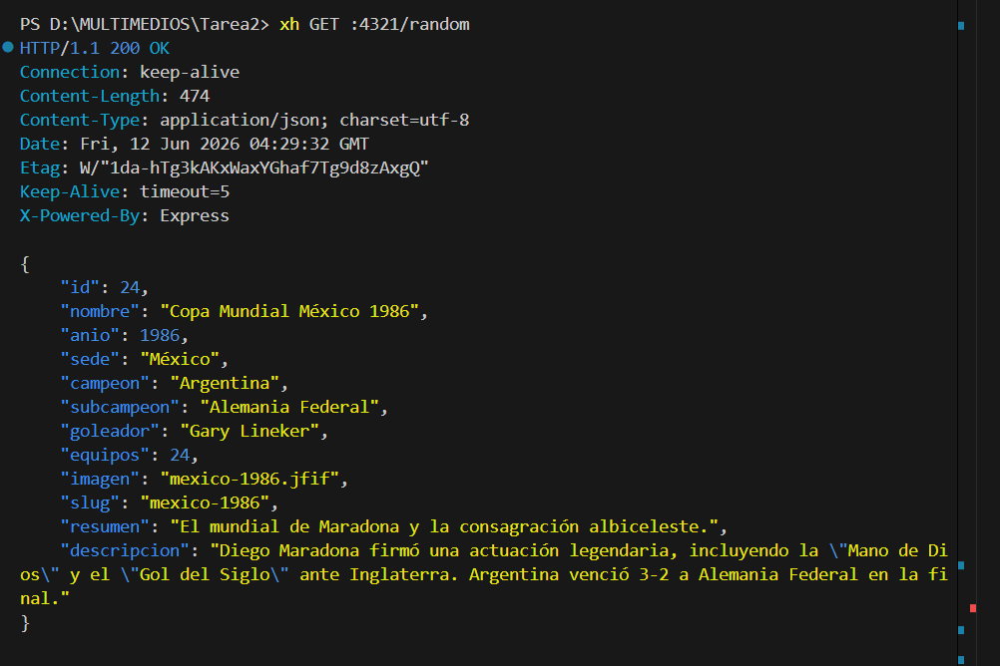
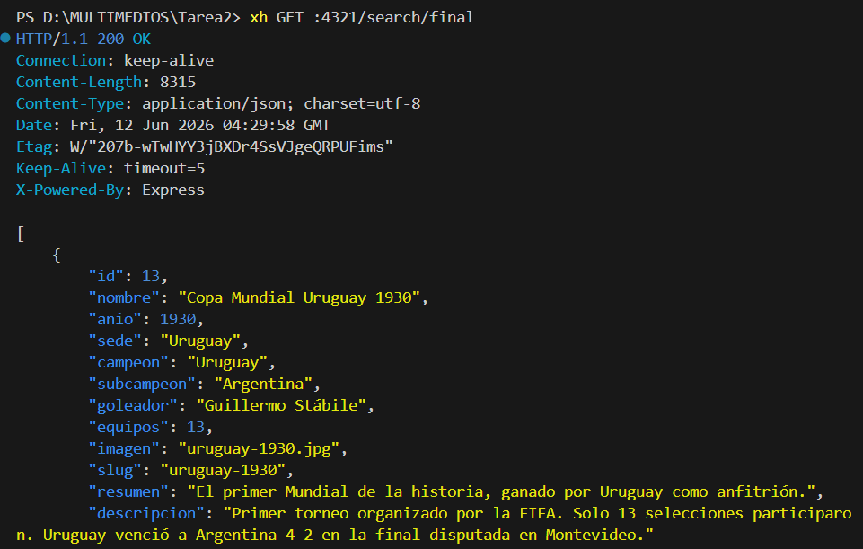
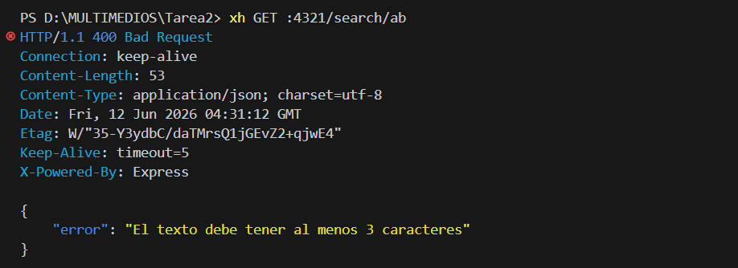

# API REST — Copa Mundial de la FIFA

API REST construida con **Node.js**, **Express**, **SQLite** y **Zod** para consultar información sobre las ediciones de la Copa Mundial de la FIFA.

## Tecnologías

- **Node.js** con módulos ESM (`import`/`export`)
- **Express** — framework HTTP
- **better-sqlite3** — base de datos SQLite (síncrona)
- **Zod** — validación de parámetros de entrada

## Requisitos

- Node.js v18 o superior

## Instalación y ejecución

```bash
# 1. Instalar dependencias
npm install

# 2. Poblar la base de datos (crear tablas + insertar datos)
npm run seed

# 3. Iniciar el servidor
npm start

# O en modo desarrollo (recarga automática)
npm run dev
```

El servidor queda disponible en: `http://localhost:4321`

## Rutas disponibles

| Método | Ruta | Descripción |
|--------|------|-------------|
| GET | `/` | Información del API |
| GET | `/mundiales` | Lista todas las ediciones (solo nombre y slug) |
| GET | `/mundiales?include=full` | Lista todas las ediciones con todos los campos |
| GET | `/mundial/:slug` | Detalle de una edición por slug |
| GET | `/campeon/:pais` | Slugs de las ediciones ganadas por un país |
| GET | `/random` | Edición aleatoria |
| GET | `/search/:text` | Búsqueda por texto (mínimo 3 caracteres) |
| GET | `/imagenes/*` | Imágenes de cada edición |

## Códigos de respuesta

| Código | Descripción |
|--------|-------------|
| 200 | Petición exitosa |
| 400 | Error de validación (Zod) |
| 404 | Recurso no encontrado |

## Ejemplos de uso (con xh / httpie) y Evidencias de Pruebas

A continuación se detallan los comandos de prueba ejecutados utilizando `xh` junto con sus respectivas descripciones y capturas de pantalla que evidencian el correcto funcionamiento del API.

### 1. Obtener todas las ediciones (Listado básico)
**Comando:**
```bash
xh GET :4321/mundiales
```
**Descripción:** Retorna una lista básica de todas las ediciones de la Copa Mundial de la FIFA registradas, mostrando únicamente el nombre y el identificador único (`slug`) de cada edición.


---

### 2. Obtener todas las ediciones con detalle completo
**Comando:**
```bash
xh GET :4321/mundiales include==full
```
**Descripción:** Permite obtener el listado de todas las ediciones, pero incluyendo la totalidad de sus campos de información (por ejemplo: país organizador, campeón, subcampeón, goles anotados, partidos jugados, etc.).


---

### 3. Detalle de una edición específica
**Comando:**
```bash
xh GET :4321/mundial/qatar-2022
```
**Descripción:** Consulta la información detallada de una edición del mundial en particular utilizando su `slug`. En este ejemplo, se solicitan los datos de Catar 2022.


---

### 4. Consulta de una edición inexistente (Error 404)
**Comando:**
```bash
xh GET :4321/mundial/inexistente
```
**Descripción:** Prueba de manejo de recursos no encontrados. Al consultar un mundial que no existe, el servidor responde con un código de estado HTTP `404 Not Found` y un objeto JSON que describe el error.


---

### 5. Buscar ediciones por campeón
**Comando:**
```bash
xh GET :4321/campeon/Argentina
```
**Descripción:** Retorna un arreglo con los identificadores (`slugs`) de todas las ediciones de la Copa Mundial que han sido ganadas por el país indicado (en este caso, Argentina).


---

### 6. Obtener una edición aleatoria
**Comando:**
```bash
xh GET :4321/random
```
**Descripción:** Retorna los datos detallados de una edición del mundial seleccionada al azar por el servidor.


---

### 7. Búsqueda por texto (Éxito)
**Comando:**
```bash
xh GET :4321/search/final
```
**Descripción:** Realiza una búsqueda aproximada de ediciones que contengan el texto de búsqueda (por ejemplo, "final") en campos como el nombre o el país organizador.


---

### 8. Búsqueda por texto con validación fallida (Error 400)
**Comando:**
```bash
xh GET :4321/search/ab
```
**Descripción:** Demuestra la validación de parámetros implementada con Zod. Dado que la API requiere un término de búsqueda de al menos 3 caracteres, realizar una consulta con 2 caracteres ("ab") genera un error de validación `400 Bad Request` y un mensaje detallado en formato JSON.


## Estructura del proyecto

```
Tarea2/
├── capturas/              # Capturas de pantalla que evidencian el funcionamiento de la API
├── public/
│   └── imagenes/          # Imágenes de cada edición del Mundial
├── src/
│   ├── db/
│   │   ├── database.js    # Conexión SQLite con better-sqlite3
│   │   └── seed.js        # Crea las tablas e inserta los datos
│   ├── middlewares/
│   │   └── errorHandler.js
│   ├── routes/
│   │   └── mundiales.js   # Todas las rutas de la API
│   ├── app.js             # Configuración de Express
│   └── server.js          # Punto de entrada
├── .gitignore
├── package.json
├── README.md
└── REFERENCIAS.md
```
